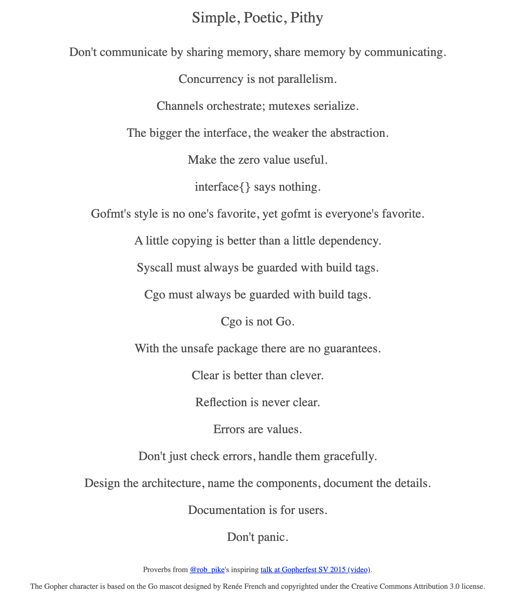
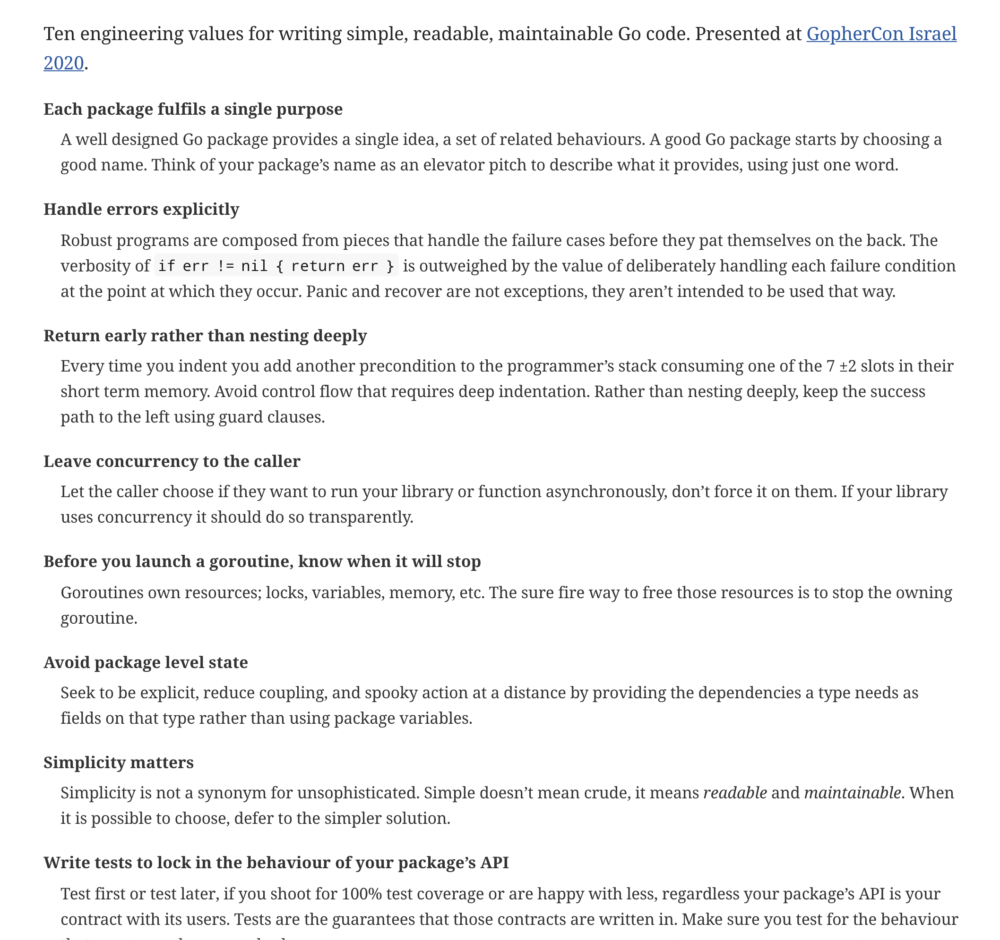
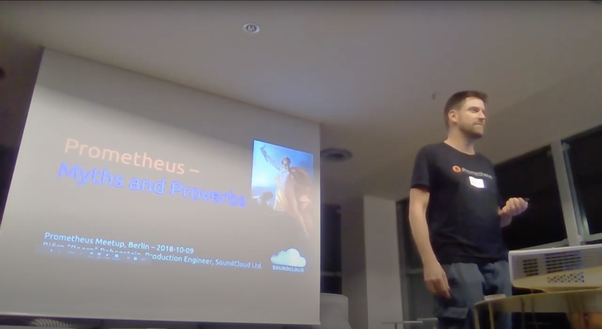
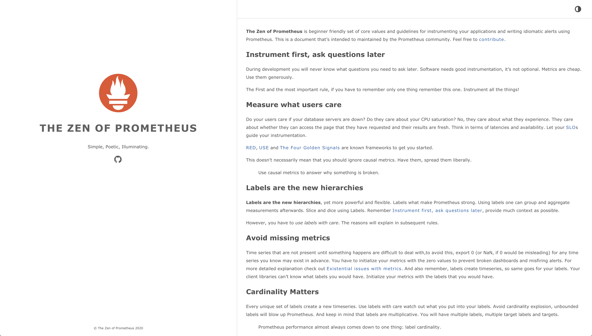
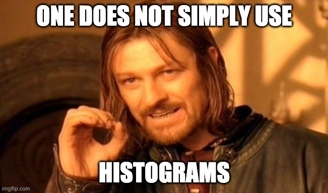
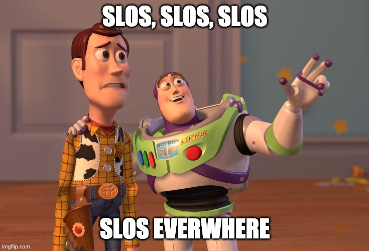

# *The Zen of* Prometheus

#### PromCon Online 2020

Note:

- Hello everyone, I hope you are enjoying the conference so far
- BREATH
- This will be a yet another best-practices talk on instrumentation and alerting using Prometheus
- I'm sure you have seen similar talks, and perhaps even better ones
- Anyhow this will be my take on it
- BREATH
- I have collected a couple of best practice as set of rules
- I'm gonna share those with you
- BREATH
- Before I start I want to make something clear, none of these are mine
- The only novel thing I'm gonna be presenting in here is the mere collection of these ideas
- BREATH
- First, who am I?

---?image=assets/img/avatar.compressed.jpg&position=left&size=48% 100%

@snap[north-east span-60 text-right text-07]

### Who am I?

@snapend

@snap[east span-60 text-right text-07]
SWE/SRE **@Red Hat**
Observability Platform Team
**Thanos** Maintainer
@snapend

@snap[south-east span-50 text-right text-07]
twitter/kkakkoyun
github/kakkoyun
@snapend

Note:

- My name is Kemal
- And I work for Red Hat as a software engineer at OpenShift Observability Platform Team
- We are building a platform to collect and store observability, signals such as metrics, logs, tracing and profilling
- BREATH
- As a team we also have SRE responsibilities, we are on-call for the platform that we are building
- So the rules that you are gonna learn about today,
- We also use them in our daily lifes on production systems
- BREATH
- Also I'm a Thanos maintainer and recently started to contribute Prometheus,
- An achievement unlocked for me
- Besides observability and monitoring topics, I'm also passionate about distributed systems and databases
- By the way, this is me on vacation, normally I don't look that happy

---

## What is a *Zen*?

Note:

- So let's start with some definitions
- What is a Zen?
- When you check the dictionary or in this case wikipedia,
- You get this definitions

+++

@quote[Zen emphasizes rigorous self-restraint, meditation-practice, insight into the nature of mind and nature of things, and *the personal expression of this insight in daily life, especially for the benefit of others.*](Wikipedia)

Note:

- Zen emphasizes rigorous self-restraint, meditation-practice, insight into the nature of mind and nature of things,
- and the personal expression of this insight in daily life, especially for the benefit of others.
- From this formal definition to use in our context, I have derived a simpler one

+++

@quote[A *collection of insights* gather from the daily life for the *benefit of others*]

Note:

- A zen is "A collection of insights gather from the daily life for the benefit of others"
- BREATH
- I'm sure you have heard similar "Zen"s before
- The first and probably the most popular of the zens, in software ecosystem, is "The Zen of Python"

+++

## Zen of **Python**

[https://zen-of-python.info/ @fa[external-link]](https://zen-of-python.info/)

Note:

- It's created 20 years ago as a Python Enhancement Proposal, PEP-20, by Tim Peters
- In this document, he captured the enginnering values behind Python in somewhat humorous way
- BREATH
- You can access these through this website or through Python interpreter
- There is an easter egg in Python interpreter
- So if you open up an interpreter prompt and type "import this", you would see the same rules
- BREATH
- We have a similar initiatives for Go as well, which is called "Go Proverbs"

+++

## **Go** Proverbs

[https://go-proverbs.github.io/ @fa[external-link]](https://go-proverbs.github.io/)

Note:

- Back in 2015, Rob Pike has created these proverbs for a legendary talk he gave in Gopherfest
- They serve more or less the same purpose
- However proverbs are a little different the Zen of Python

+++

## So what is a *proverb*?

### What makes it different?

Note:

- So what is a proverb?
- What makes it different?

+++

@quote[proverb: a short, well-known pithy saying, stating a general truth or piece of advice]

Note:

- A proverb is a short, well-known pithy saying, stating a general truth or piece of advice
- BREATH
- In this context, it is a pithy saying that designed to reveal a deeper truth about the design of a language
- BREATH
- Eventhough practically they are similar, they serve different purposes
- Proverbs are revealing intentions behind the design of Go
- They require deeper understanding of the language
- BREATH
- So in this sense they are not same as the rules in The Zen of Python
- Where The Zen of Python was capturing the engineering values behind the language
- Luckily now we also have "The Zen of Go"

+++

## The Zen of **Go**

[https://the-zen-of-go.netlify.app/ @fa[external-link]](https://the-zen-of-go.netlify.app/)

Note:

- Dave Cheney gave this great talk about "The Zen of Go" At GopherCon Israel this year
- He aimed to create a set of rules to convey the enginnering values behind Go
- He wanted them to be more beginner friendly,
- BREATH
- In the talk, he also thinks about the ways to communicate these rules
- How do we teach them?
- How do we enforce them?
- How do we evolve them?
- BREATH
- After watching that this idea came to me, "Why don't we have a similar set of rules for Prometheus"?
- Of course, as none of my ideas, this wasn't as novel as I thought it is.
- BREATH
- Björn Rabenstein has already asked the same question and,
- as an answer,
- He gave a talk about it at Berlin Prometheus Meetup, a couple of years ago

+++

## Prometheus **Proverbs**

Note:

- Bjorn, in his talk, told that he had the idea after he watched the talk by Rob Pike
- And he had been collecting these proverbs for awhile, at the time he gave this talk
- BREATH
- So he canonized 5 proverbs

+++

- Instrument first, ask questions later
- Counters rule and gauges suck
- First the rate, then aggregate
- Labels are the new hierarchies
- If you can graph it, you can alert on it

Note:

- BREATH
- Instrument first, ask questions later
- Counters rule and gauges suck
- First the rate, then aggregate
- Labels are the new hierarchies
- If you can graph it, you can alert on it
- BREATH
- They are simple and poetic
- They are beautifully stated and catchy
- BREATH
- For me, these rules are closer to the Zen than the Proverbs
- So I decided to built upon them
- BREATH
- Also in his talk, Björn jokes about he could be starting a tradition and,
- Someday, somebody would add more rules and,
- Would build a website out of it
- BREATH
- So here I am, delivering what promised and fulfilling the prediction
- I give you "The Zen of Prometheus"

+++

## The Zen of **Prometheus**

[https://the-zen-of-prometheus.netlify.app/ @fa[external-link]](https://the-zen-of-prometheus.netlify.app/)

Note:

- Following the path of Björn and inspired by Dave Cheney,
- I tried to create a set of rules to help engineers to create good metrics and alerts for their services

+++

@snapend

@snap[west span-50 text-06]

- **Instrument first, ask questions later**
- Measure what users care
- **Labels are the new hierarchies**
- Avoid missing metrics
- Cardinality Matters
- Naming is hard
- **Counters rule and gauges suck**
- **First the rate, then aggregate**
- If you can log it, you can have a metric for it

@snapend

@snap[east span-50 text-06]

- One does not simply use Histograms
- **If you can graph it, you can alert on it**
- If you run it, then you should put an alert on it
- Alerts should be urgent, important, actionable, and real
- Symptom-based alerts for paging, caused-based for troubleshooting
- Please five more minutes
- Context is king

@snapend

Note:

- So here they are..
- -Bold ones are the proverbs, by the way-
- BREATH
- I want these to be catchy and
- Beginner friendly
- BREATH
- As my teammate Matthias, you might know him as `metalmatze`, beautifully put,
- "These should be explicit and concise enough to give the message in a conversation that you have in conference hallway track"
- BREATH
- I'm not gonna read them one by one,
- For the rest of the talk, I'm gonna highlight a couple of those rules which I believe the most fundamental and insightful!
- BREATH
- Björn already explained the ones he has canonized in-depth in his talk, so you better watch it for those
- That being said I can't just start without repeating the first rule...
- END OF ACT ONE

---

## **Instrument first**, ask questions later

Note:

- Instrumentation is the key to understanding how our applications run and behave in action
- According to myths, Prometheus has started as an instrumentation library,
- So it's just prober to start focusing on instrumentation
- Good software needs good instrumentation
- It's not optional, it's essential
- So spread them liberally to ask the prober questions when we need them

---

## Measure what *users* care about

Note:

- Measure what users actually care about
- Do your users care if your database servers are down?
- Do they care about whether your CPU is saturated?
- No, they care about what they experience
- They care about whether they can access the page that they have requested and,
- Whether their results are fresh!
- BREATH
- So rather think in terms of latencies, availability and error rates while instrumenting your services
- Think how you would measure user experience!

+++

@ul

- SLOs
- RED
- USE
- The Four Golden Rules

@ulend

Note:

- Let your SLOs guide your instrumentation
- RED, USE and The Four Golden Signals are known frameworks to get you started with
- Use them if you do not have any idea where to begin from

---

## Cardinality Matters

Note:

- Cardinality Matters
- BREATH
- Every unique set of labels create a new timeseries
- Remember that
- Use labels with care
- BREATH
- Watch out what you put into your labels
- Do not put unique identifiers into you labels

+++

### Labels are multiplicative

Note:

- Remember: Labels are multiplicative
- And keep in mind that labels are multiplicative
- You will have multiple labels on metrics,
- multiple target labels on your targets,
- and you will have multiple targets
- So things could get out of control pretty quickly and nastily
- BREATH

+++

@quote[Prometheus performance almost always comes down to one thing: label cardinality]

Note:

- Remeber when it comes to performance, it's almost always about one thing:
- And it is label cardinality!

---

## One does not simply use *Histograms*

Note:

- One does not simply use Histograms
- Some of you may have realized already
- This rule is generated from a meme which has created from a line from lord of the rings

+++

Note:

- Histograms are powerful
- With a single histogram metric,
- You can monitor your http service
- You can build RED dashboards,
- And meaningful alerts

+++

### With **great power** there must also come **great responsibility**

Note:

- However, histograms are not the easiest metric to use
- Peter Parker principle
- To ensure usefullness of your observations and correctness of your alerts,
- You have to come up with a meaningful bucket layout
- And creating a correct bucket layout for your histograms is an art form
- BREATH
- Coming up with a bucket layout SOMEWHAT conflicts with the "Instrument first, ask questions later" rule
- Because you need to have idea about your latencies before you even measure
- To circumvent this issue you can take an iterative approach or,
- You can use an event system to obtain your latency distribution

+++

Note:

- And as always, let your SLOs guide your bucket layout
- Create boundaries that match your SLOs

+++

### Cardinality is key

Note:

- Watch out your cardinality!
- The histograms underneath are just counter with labels
- Where bucket boundaries used as labels
- Be precautious while adding additional labels to your histograms
- Remember Labels are multiplicative, they can easily get out of control

---

## *Symptom-based* alerts for paging, *caused-based* for troubleshooting

Note:

- This should be a remedy to one of the most common mistakes we see with the alert creation
- It doesn’t matter if your CPU is saturated, as long as, your users don’t notice
- BREATH
- Your paging alerts should be urgent, important, actionable, and real
- You wouldn't want to be woken in the middle of the night, for the problems would eventually go away
- Your alerts should represent either ongoing or imminent problems with your service
- BREATH
- For that, symptoms are a better way to capture problems more comprehensively,
- and robustly with less effort
- You should almost always be able to classify the problem into one of: availability, latency or correctness
- BREATH
- That being said, include cause-based information in your alerts, but avoid alerting directly on causes
- Use them for troubleshooting promlems in your systems

---?image=assets/img/screenshot.png&position=left&size=40% 100%

@snap[north-east span-60]

### Now It's **Your** Turn to contribute

@snapend

@snap[south-east span-40]

@snapend

Note:

- As I told you at the beginning of the talk, I want this to be a community effort
- I dream this would become an entrypoint for beginners and for the ones who seeks best practices
- So feel free to contribute, add and change the rules,
- Any types of contributions are more than welcome!
- With that,
- That's it from me :)
- Thanks a lot for listening

---?image=assets/img/red_hat_white.png&size=60%
